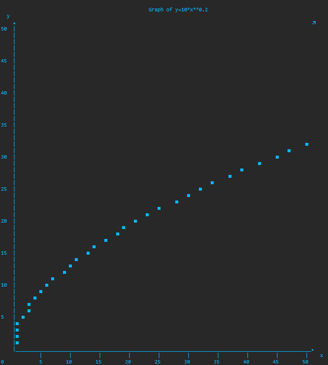

# Grapher     
 
Grapher is a basic graphing tool which uses print statements to output a line.
The line is made up of Unicode characters that are output in the interpreter.
	

Usage

In order to use the program, you have to input an expression in the format of 'y=x'. 
You must use Python operators correctly in your expression to get a desired result.
After your expression is input, the program will prompt for the size of the graph and the 
scale of the values on the axes. 
After this information is input, your graph should appear with a final input that asks 
if you want the points output separate from the graph.

Issues
	
This program can be inaccurate at times and particularly has issues when working with 
negative and extremely large values. 
This program is not accurate, as Unicode characters are not square, which causes
distortion. The values in the program are also rounded to the nearest one value which 
is required for the function of this program, but also decreases accuracy.
	
